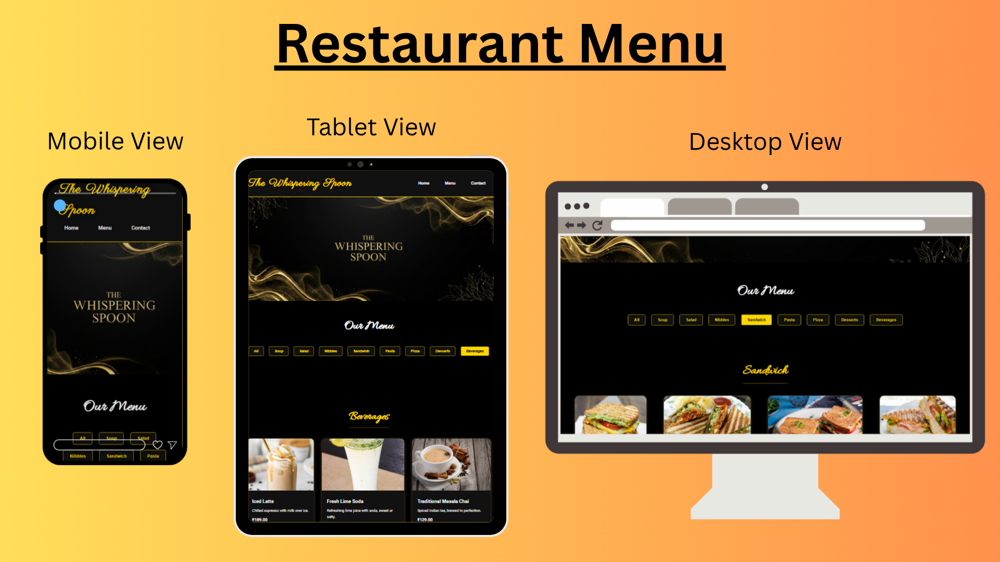

**CodSoft UI/UX Internship**  
# 🍽️ Task 3 – Restaurant Menu UI Design  
**Designed by:** *Ishaan*

---

## 📌 Overview

This project is a **responsive restaurant menu UI** created for Task 3 of the CodSoft UI/UX Internship.  
It showcases a modern digital menu for a fine-dining restaurant called **“The Whispering Spoon”**, featuring elegant design, smooth horizontal scrolling, and aesthetic typography.

---

## ✨ Features

- 📱 **Fully responsive layout** for desktop and mobile
- 💛 **Black & Gold premium theme**
- ✨ **Horizontal scrolling rows** for categories (like marquee-style)
- 🍝 Categories: Soup, Salad, Nibbles, Sandwich, Pasta, Pizza, Desserts, Beverages
- 🎨 **Stylish fonts** like *Great Vibes*, *Parisienne*, *Allura*, *Sacramento*
- 🖼️ Images for each item with name & price
- 🔍 **Hover zoom** effect on food items
- 🔝 “Scroll to top” button
- 📷 Banner on top for visual branding

---

## 🧰 Technologies Used

- HTML5  
- CSS3 (including flexbox and horizontal scroll)  
- Google Fonts (No external scripts or frameworks)

---

## 📸 Preview

> Here's a screenshot preview of the menu layout:



---

## 📂 Folder Structure

```
Task 3 - Restaurant Menu/
├── menu.html
├── style.css
├── banner.png
├── preview.png
├── images/
│   ├── soup/
│   ├── pasta/
│   ├── desserts/
│   ├── beverages/
│   └── ...etc
└── README.md
```

---

## 🔗 How to Run

1. Download or clone this repository.
2. Place all menu item images and `banner.png` in the `images/` or root folder as needed.
3. Open `menu.html` in your browser.
4. Scroll through the menu and enjoy the design!

---

## 🙌 Internship Credit

Created as part of the **UI/UX Internship Program by [CodSoft](https://www.codsoft.in/)**  
**Task 3:** Build a responsive restaurant menu page with category sections and UI enhancements.

---

## 📫 Connect with Me

- 📧 Email: *ishaanralhan0@gmail.com*  
- 💼 LinkedIn: [linkedin.com/in/ishaan-500900351](https://www.linkedin.com/in/ishaan-500900351/)  
- 🌐 GitHub: [github.com/Ishaan-2589](https://github.com/Ishaan-2589)

---
